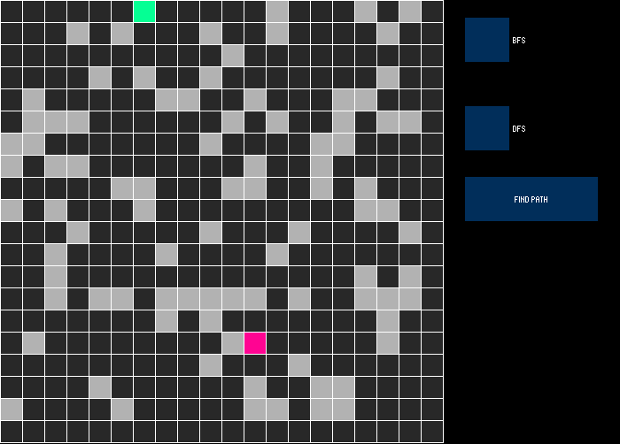

# Maze Pathfinding

## Description

The aim of this project was to find the optimal path between two points (starting point and arrival point) in a grid made up of cel free and cel obstacles, and this grid represents the maze in question.

The solution of this problem has been done thanks to the implementation of two algorithms breadth first search and deep first search.

<table align="center">
    <tr>
        <td>
             
            <figcaption align="center">
                BFS
            <figcaption>
        </td>
        <td> </td>
        <td> 
             
            <figcaption align="center" >
                DFS
            <figcaption>
        </td>
    </tr>
</table>

The most importent used libraries:

### - Processing External Libraries
-  **controlP5**: used to create the UI buttons and radios

****

## Project Files

```bash
|____assets
| |____images
| | |____bfs.gif #readme image
| | |____dfs.gif #readme image
|____maze
| |____class.pde # contains the classes
| |____maze.pde # # contains the main programme
| |____utile.pde # contains utils functions
|____readme.md
```

****

## Installation

<a href="https://processing.org/download">Processing</a> is needed to run the programme.


****

## Usage

- Open and run the **`maze.pde`** with Processing.

- Choose one of the two algorithms (dfs, bfs) on the right part of the window

- Click on the **`FIND PATH`** button to start the search

- Reset the positions of the obstacles, start and end cells by clicking on **`Reset`** button the appears at the end of each search
